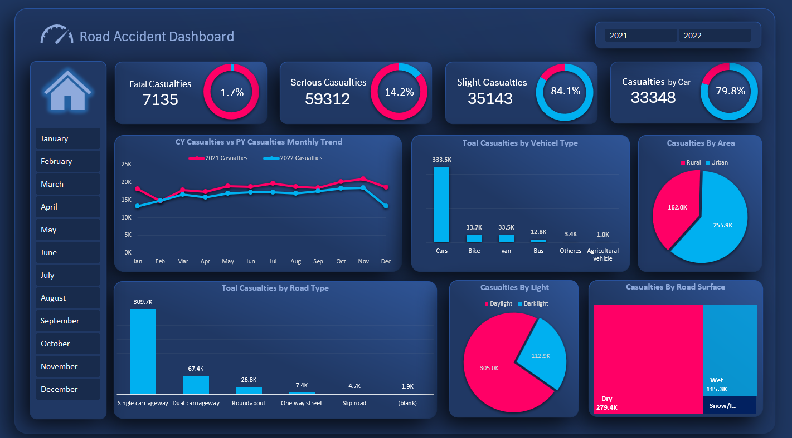

# Road-Accident-Dashboard

An interactive **Road Accident Dashboard** created using Microsoft Excel to analyze road accident casualties and identify important patterns and trends.

## Dashboard Preview

## Project Overview

This project focuses on analyzing road accident data and presenting key insights through an interactive Excel dashboard.

The dashboard provides a clear view of accident casualties based on different categories such as vehicle type, road type, area, lighting conditions, road surface, and monthly trends.

## Key Analysis

- Total Fatal Casualties
- Total Serious Casualties
- Total Slight Casualties
- Casualties by Vehicle Type
- Monthly Casualty Trend
- Casualties by Rural & Urban Area
- Casualties by Road Type
- Casualties by Light Condition
- Casualties by Road Surface
- Year-wise and Month-wise Analysis

## 🛠️ Tools & Skills Used

- Microsoft Excel
- Excel Pivot Tables
- Pivot Charts
- Slicers
- Data Cleaning
- Data Analysis
- Data Visualization
- Excel Formulas
- Dashboard Design

## 🎯 Project Objective

The objective of this project is to transform raw road accident data into an interactive and easy-to-understand Excel dashboard.

The dashboard helps identify accident trends, casualty patterns, and differences across various road and environmental conditions.

## 📌 Dashboard Features

- Interactive Year Selection
- Monthly Filters
- KPI Cards
- Interactive Charts
- Monthly Trend Analysis
- Vehicle Type Analysis
- Area-wise Analysis
- Road Type Analysis
- Light Condition Analysis
- Road Surface Analysis

## 💡 Key Insights

- The dashboard provides a comparison of casualties across different vehicle types.
- Monthly trends help identify changes in casualties throughout the year.
- Rural and urban areas can be compared based on total casualties.
- Road type, lighting conditions, and road surface provide additional perspectives for accident analysis.

## 👨‍💻 Project Type

**Excel Data Analytics & Dashboard Project**

---

⭐ If you found this project useful, feel free to explore the repository.
